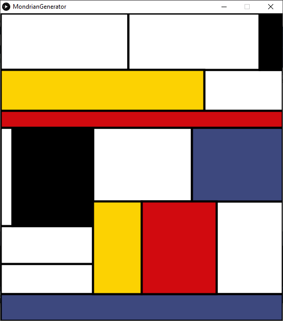

A program to procedurally generate pictures resembling those of the abstract artist Piet Mondrian. 

You know the type, even if you don't think you do. The ones with all the rectangles and primary colours.

To help, here's a pretty typical example of one of his paintings -

For comparison, here are a few that my program produced -

The way it works is by dividing the window into two component rectangles in a mostly random ratio[1](#footnote1), and then recursively doing the same to each of those rectangles. A priority queue is used so that the biggest remaining rectangle is the next to get split.  
Once that's been done an appropriate number of times[1](#footnote2), it fills in random rectangles with specified colours, currently the three primary colours plus black.

To generate a new picture, simpy press space.  
If you happpen to like how the shapes turned out but not the way they ended up being coloured, you can press 'c' and it will use the same shapes but with different colourings.

1. It's not purely random because it won't allow a 99:1 split for example. The resulting lines would be too close together which wouldn't end up looking good. 

2. An "appropriate" number being entirely subjective of course. At the moment it's 17, as that's more or less what I thought looked best.
